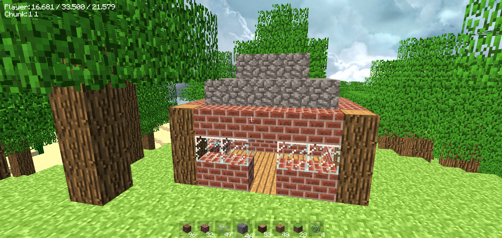
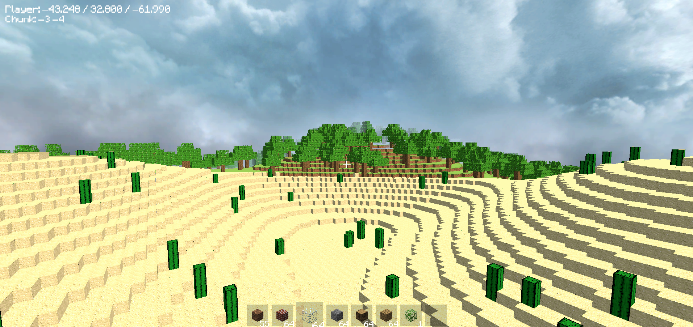

# Minecraft Clone
Minecraft clone created in Unity to learn about procedural generation and mesh manipulation.

## Features

- Infinite procedurally generated world
- Optimized chunk system
- Multiple biomes
- Block placing/removing
- Debug menu

## Screenshots

